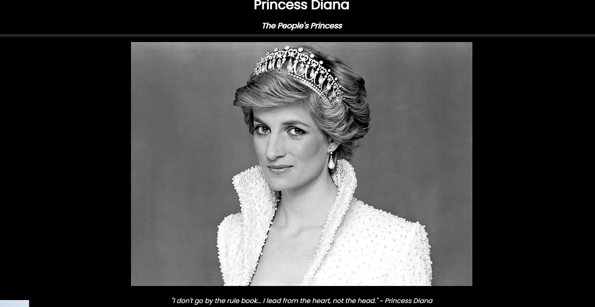
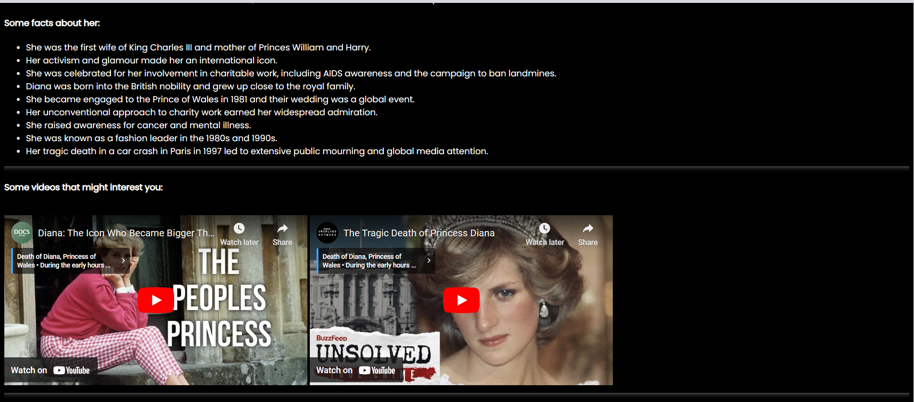

## Princess Diana Tribute
This is a web-based tribute to Princess Diana, showcasing her life, achievements, and legacy. The project includes a detailed description of Princess Diana's life, some notable facts, and multimedia elements such as images and videos.

## Features
Responsive Design: The website is designed to be responsive and look good on various devices.
Multimedia Content: Includes images and YouTube videos to provide a richer user experience.
Information Sections: Detailed information about Princess Diana's life, achievements, and impact.

## Preview

The web page looks like this 

### Main Page

### About Section

Use the link to see the deployed web page: https://nehaannie.github.io/Tribute_page_for_Princess_Diana/

## Code Structure
index.html: The main HTML file containing the structure and content of the tribute page.
pricess:the image used for the web page

## Acknowledgments

Google Fonts for the typography.
YouTube for the video content.

## Contact
For any questions or suggestions, feel free to open an issue or contact me at nehaannie2002@gmail.com

